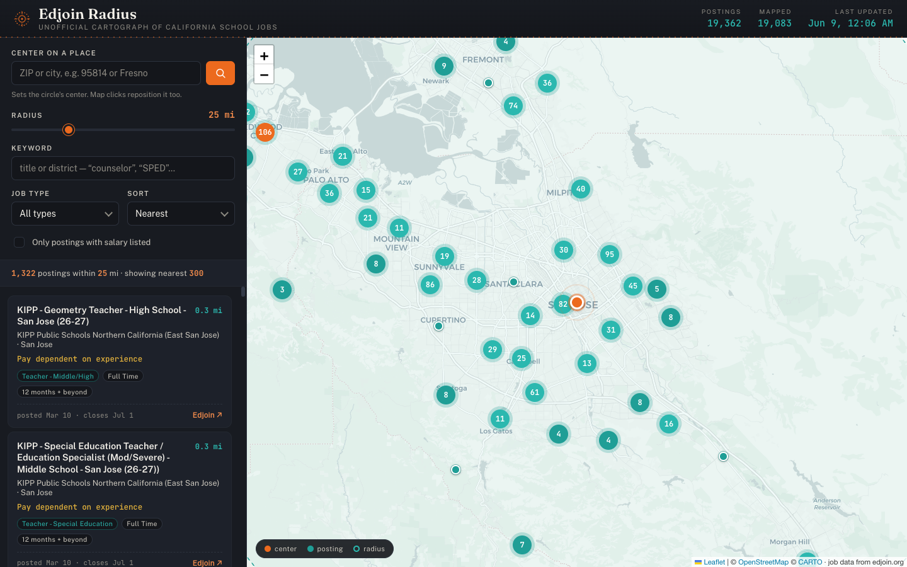

# Edjoin Radius

An unofficial **radius-based map** of California school-job postings from
[edjoin.org](https://www.edjoin.org/). Edjoin's own site only supports ZIP-code
search in a legacy UI and shows 10 results at a time — this tool pulls **every**
current posting, places each on a map, and lets you find jobs **within N miles**
of any ZIP, city, or point you click.



## How it works

Edjoin's search is powered by a public, unauthenticated JSON endpoint
(`/Home/LoadJobs`). The UI caps page size at 10; this project requests 1,000 per
page and pulls all ~19k California postings in ~20 requests. The list data has no
coordinates (and `zip` is always null), so each posting's exact street address is
scraped from its detail page and geocoded locally.

### Pipeline (each step writes a file the next one reads)

```
scripts/scrape.mjs         →  data/jobs.json        all postings from the list API
scripts/geocode.mjs        →  data/geocache.json    city → lat/long  (fallback-tier cache)
scripts/scrape-details.mjs →  data/details.json     detail pages: exact address, salary,
                                                     employment type, work year, contact
scripts/geocode-exact.mjs  →  data/jobs.geo.json    precise coords + detail fields
public/  +  scripts/serve.mjs                        static site (Leaflet + CARTO, no keys)
```

**Only `data/jobs.geo.json` is needed at runtime** — the site fetches just that
one file. Everything else (`jobs.json`, `details.json`, `geocache*.json`) is a
build input or an incremental cache. All of them are committed and written
**one record per line** (still valid JSON, ~same size as minified), so a refresh
shows up in `git diff` as exactly which postings/salaries/locations changed.

### Why scrape detail pages

The list API (`LoadJobs`) is fast but thin: it has **no coordinates** and frequently
returns **null salary** even when the posting lists one. Each posting's detail page
(`/Home/JobPosting/{id}`) carries the exact street address, the real salary (in two
shapes — a structured "Pay Range" and a free-text "Pay dependent on experience" +
"Add'l Salary Info" range), employment type, length of work year, openings, and
contact info. `scrape-details.mjs` collects all of it in one concurrent pass
(resumable, cached by posting ID).

Everything in the browser — radius filtering, keyword/type filters, the
distance-sorted list — runs client-side over the precomputed snapshot.

### Location precision (tiered, best first)

Each posting's detail page (`/Home/JobPosting/{id}`) carries an exact street
address + ZIP in its schema.org JSON-LD. `geocode-exact.mjs` resolves each to
coordinates and tags the precision used:

1. **`address`** — exact street address via the **US Census batch geocoder**
   (free, keyless). Despite its documented 10k/request limit it 500s on large
   batches, so we send ~150 at a time and **recursively split** any failed batch
   down to size 1, isolating the occasional malformed address.
2. **`zip`** — ZIP centroid (Nominatim, cached) when the street doesn't match.
3. **`city`** — city centroid (`geocache.json`) as a last resort.

This is what spreads postings across their real locations instead of stacking
every job in a city on one point.

## Usage

```bash
# Fast path — city-level locations only (~1 min total)
npm run build-data        # scrape + city geocode
npm run serve             # → http://localhost:5173

# Precise path — exact per-posting street locations (recommended)
npm run build-exact       # scrape + city + address scrape + Census geocode
npm run serve
```

`build-exact` adds two steps: scraping each posting's detail page (resumable,
cached in `data/details.json`) and batch-geocoding the addresses. Both caches are
incremental, so refreshes only fetch what's new. Tune scrape speed with
`CONCURRENCY=16 npm run details` (default 12 concurrent fetches).

### Keeping it up to date

Edjoin postings change daily. To refresh:

```bash
npm run refresh     # alias for build-exact — re-pulls the list, fetches only
                    # NEW postings' details, geocodes only NEW addresses
npm run serve
```

Because every cache is keyed by posting ID / address, a refresh is fast after the
first full build: `scrape.mjs` always re-pulls the *current* list (so removed
postings drop out and new ones appear), while `scrape-details.mjs` and the
geocoders skip anything already cached.

Two things to know:

- **Existing postings' details are frozen.** Once a posting's detail is cached, a
  refresh won't re-fetch it. If a district edits a salary after posting, bump
  `SCHEMA_VERSION` in `scrape-details.mjs` (forces a full re-scrape) or delete
  `data/details.json`.
- **The detail cache only grows.** Stale (removed) postings linger in
  `details.json` but are ignored — only postings in the current `jobs.json` reach
  the site. Delete `data/details.json` occasionally if you want to prune.

To automate a daily refresh, wrap `npm run refresh` in a `cron` job (macOS:
`launchd`/`crontab -e`), e.g. `0 6 * * * cd /path/to/edjoin-aggregator && npm run refresh`.

### In the app

- **Center on a place** — type a ZIP (`95814`) or `City, CA`, or just click the
  map / drag the orange pin.
- **Radius** — slider in miles; the ring and result list update live.
- **Filters** — keyword (title/district/city), job type, "has salary listed".
- **Results** — sorted by distance (or newest / A–Z); click a card to fly to its
  marker; each links to the original Edjoin posting.

## Design notes

- **Tech:** vanilla JS + Leaflet + `leaflet.markercluster`. No build step, no
  framework, no API keys. A tiny Node static server (`scripts/serve.mjs`) exists
  only so the page can `fetch` the data file.
- **Geocoding precision:** exact street address per posting (US Census), falling
  back to ZIP then city only when an address can't be matched. `geocode.mjs`
  builds the city-fallback cache; in the precise pipeline its `jobs.geo.json`
  output is immediately overwritten by `geocode-exact.mjs` — that step is kept
  only for the `geocache.json` cache, which is built once and reused, so reruns
  are fast.
- **Geocoder sources:** US Census batch (addresses, no rate limit) + Nominatim
  (ZIP/city fallback, 1 req/sec per their policy), both cached aggressively.

## Etiquette

The scraper identifies itself, rate-limits, and the data stays local. This is a
personal browsing aid over publicly available listings — don't redistribute the
scraped dataset or hammer the endpoints.

## Spec

Design rationale and the full API reconnaissance are in
[`docs/superpowers/specs/2026-06-08-edjoin-radius-map-design.md`](docs/superpowers/specs/2026-06-08-edjoin-radius-map-design.md).
